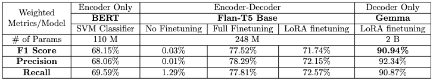

# LoRA LLM Instruction Finetuning for ASAG
This is the working repository for my CS6120 Natural Language Processing Project.

### Team
- Gugan S Kathiresan - 002756523
- Aditya Shanmugham - 002738073
- Prabhleenkaur Bindra - 002781738
- Maria Anson - 002931419

### Summary 
The goal of this project is to implement an ASAG (Automated Short Answer Grading) architecture that aims to be used for grading short computer science and coding assignments harnessing the knowledge within a finetuned LLMs, and be open for user interaction.

The proposed methods perform Instruction fine-tuning with PEFT/ LoRA of an LLM.

As mentioned previously, using a domain of course rubrics, questions and answers, the proposed model would posses interactive capabilities to perform Logical Reasoning and allow the user to receive feedback on their assignments. By specifying a rubric and opening up the LLM for interaction, we are both harnessing the knowledge of LLMs to provide constructive feedback, but are also avoiding any catastrophic forgetting, thereby making this scalable for applications like:
- Organization Knowledge Transfer (KT)
- Automated Test / Resume / Essay Evaluation
- Recommendations on how to improve prompts, content, etc.

## Official Abstract
_"The ability to fine-tune LLMs to different domains has enabled organizations and researchers to adapt their foundation models to their liking. In recent days, Parameter Efficient Fine-Tuning (PEFT) has made this possible on lower computational requirements compared to training LLMs
on new domains from scratch. Fine-tuning LLMs have various applications, but a simple way of putting it would be, teaching your LLM to talk in the tone, vocabulary and structure. In this study, we attempt to extend these benefits to the image modality. Visual Question Answering is a
popular domain that combines Computer Vision and NLP. We attempt to employ VQA models to identify the components of an image, and employ an LLM adapter to modify the results according to the logical reasoning of the user input question. Through this project, we extend the application to Automated Short Answer Generation(ASAG), to classify and provide an objective feedback to students. We intend to explore various finetuning techniques and datasets to achieve this task."_

## Results:

### Model Comparison

**Table 1:** Model comparison based on number of parameters and F1 score

## Conclusion

_"In conclusion, our research highlights the importance of considering both performance and training cost when selecting an LLM for imbalanced datasets. LoRA fine-tuning offers a promising avenue for achieving competitive performance with reduced training times and costs. When model size necessitates significant cost increases without commensurate performance gains, smaller models like Gemma can provide an effective solution."_

## Files and Folders:
In order of execution during project development:
- ./Dataset/ contains data files, and required for EDA, data preprocessing
- ./BERT-Classifier/ contains evaluation code
- ./FlanT5/ contains training and evaluation code, and model files
- ./Gemma/ contains training and evaluation code, and saved model links
- "CS 6120 NLP final project.pptx" contains the final presentation of the results
- "CS 6120 NLP final report.pptx" contains the overall report for this project

Note: The respective packages to install are placed within each directory in its own requirements file.